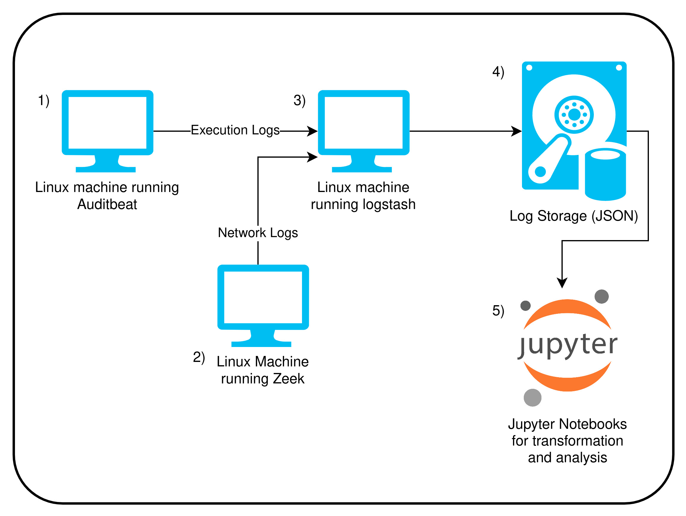

# Udacity Data Engineering Capstone Project

## Table of Contents

1. [What](#what)
2. [Why](#why)
    1. [Data Generation](#data_generation)
    2. [Data Analysis](#data_analysis)
3. [How](#how)
    1. [Hosts Architecture](#hosts_architecture)
    2. [What is everything doing?](#what_is_everything_doing)
    3. [Data sources](#data_sources)
4. [Data Model Choice](#data_model_choice)
5. [Addressing Other Scenarios](#addressing_other_scenarios)
    1. [The data was increased by 100x](#data_increses_100x)
    2. [The pipelines would be run on a daily basis by 7am](#pipelines_run_daily)
    3. [The database needed to be accessed by 100+ people](#access_by_100_users)
6. [How to use this project](#how_to_use_this_project)
    
    
---

<a name="what"></a> 
## What

This project gets data from 2 different data sources, network logs, and host logs, and uses them to identify anomalous behavior in the network. These 2 logs are 2 of the most straightforward ones when the point is to have good intelligence with relatively low effort, and that's why those 2 sources were chosen.

<a name="why"></a> 
## Why

<a name="data_generation"></a> 
### Data Generation

There is a big spectrum of tools that can be utilized to gather the information, however, thinking on a scenario that could be done using only free and/or open source solutions, the end game utilized tools from Elastic and Zeek projects, as follows:

- **[Zeek](https://zeek.org/)**: Network log aggregation and ingestion.
- **[Logstash](https://www.elastic.co/pt/logstash/)**: A host that will listen in the network for files being sent from whatever source configured, and output them into a more structured folder schema to help out with the data lake formation and log centralization.
- **[Filebeat](https://www.elastic.co/pt/beats/filebeat)**: Gather logs from local Zeek machine and send them to the Logstash host.
- **[Auditbeat](https://www.elastic.co/pt/beats/auditbeat)**: Gather host logs like network, commands and so on, and sends them to the Logstash Host.
- **[Network Log Generation](https://github.com/aJesus37/for_url_curl)**: To generate the fake network traffic, I've built a tool in Bash that get's a list of URLs and sends a cURL request to it. The URL list I've used here is the [majestic million](https://www.google.com/search?channel=trow5&client=firefox-b-d&q=majestic+million).

<a name="data_analysis"></a> 
### Data Analysis

Usually in the security monitoring scenario, tools that are commonly used to aggregate and analyze data are the so called [SIEM](https://en.wikipedia.org/wiki/Security_information_and_event_management)s, and theses tools work pretty well for what they are supposed to, however, they are very pricey as the more logs you have. Thinking in a solution that could have a similar analysis potential but would be cheaper, a good way of doing so would be with a data lake architecture using [Spark](https://spark.apache.org/) as it's core.
With this in mind, all the transformation, search and analysis in this project is made with Pyspark, the Python API to Spark.

<a name="how"></a> 
## How

<a name="hosts_architecture"></a> 
### Hosts Architecture



<a name="what_is_everything_doing"></a> 
### What is everything doing?

1. Linux machine generate host logs through Auditbeat and sends them through network to Logstash Host.
2. Linux machine generate network logs through Zeek and sends them through network to Logstash Host.
3. Logstash host listens to and receive logs through network, process it and creates folders locally in Hive partition format. A cool upgrade here would be to have logstash sending these logs to S3, but since we want it to be cheap, local storage is used insted.
4. Logs are stored locally in the Logstash host.
5. Jupyter notebooks are used to transform and analyze the generated data using Pyspark as it's core Engine.

<a name="data_sources"></a>
### Data Sources

- Auditbeat: Host Logs
- Zeek: Network Logs

<a name="data_model_choice"></a> 
## Data Model Choice

Logs are a different scenario regarding data modelling. For most use cases, no transformation in the raw data is ever needed, since any transformation usually happens at read time, depending on the given analysis that will take place. Because of that, the final data model is the same as the format that the utilized tools (auditbeat and zeek) generate.

<a name="addressing_other_scenarios"></a>
## Addressing Other Scenarios

<a name="data_increses_100x"></a>
#### The data was increased by 100x

This scenario is easy to manage while using Spark, which is a big data tool. In this case, the easiest way to deal with the scenario is to horizontally escalate the Spark Cluster that works with the data.

<a name="pipelines_run_daily"></a>
#### The pipelines would be run on a daily basis by 7am 

Apache Airflow could be used as the scheduler to run the specific tasks as notebooks or python scripts.

<a name="access_by_100_users"></a>
#### The database needed to be accessed by 100+ people

Apache spark is a tool that work well with large data, but to address the large number of users, a tool that can manage the user and access part of Spark is [Databricks](databricks.com/) (althought it's a paid tool).


<a name="how_to_use_this_project"></a>
## How to use this project

This projects utilizes pyspark do run all the transformation and analysis. To make it easier and more immutable the process of having the environment to work with spark, I've also built [this container](https://hub.docker.com/repository/docker/ajesus37/pyspark-docker) to have all the programs needed without need to configure it.

To use this container, run as follows (supposing you already have docker on your machine):

```bash
PROJECT_PATH="<ABSOLUTE_PROJECT_PATH>"

docker pull ajesus37/pyspark-docker

docker run --rm -it -p 8888:8888 -v $PROJECT_PATH:/home/user/udacity_project ajesus37/pyspark-docker bash

cd /home/user/udacity_project

bash auxiliary/unpack_raw_dataset.sh

pyspark

```

**The above commands should do the following:**

1. Download the pyspark-docker image locally;
2. Execute the container image sharing the project path and the container;
3. Decompress the raw dataset inside the project folder;
4. Start JupyterLabs with pyspark backend already working;

After that, get the url with 127.0.0.1 in it from the terminal output and paste it in your browser. The first notebook you need to run in order to use the files is the `ETL.ipynb`, it will generate the datalake from the raw logs. Now you just need to navigate through files and execute the notebooks as wished.